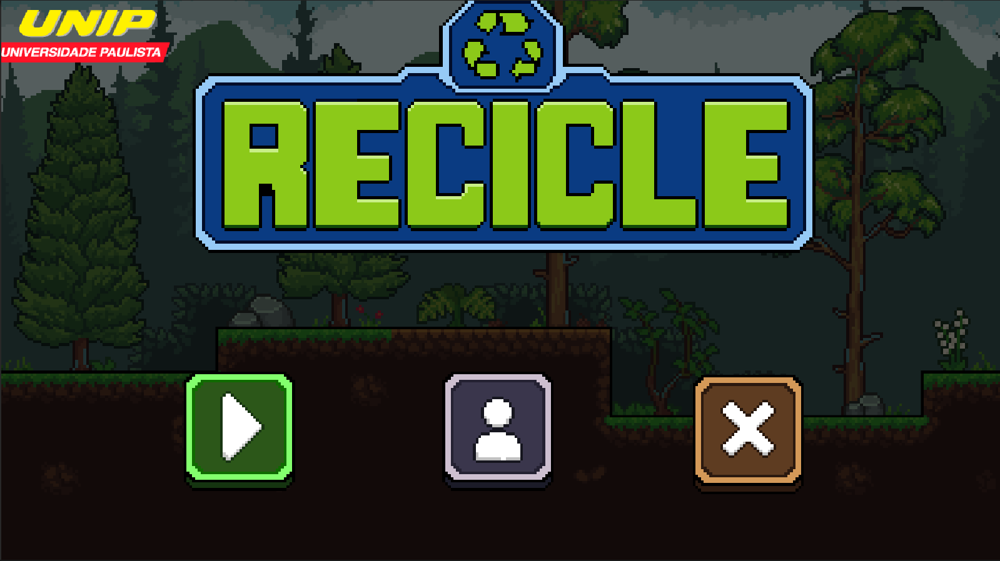
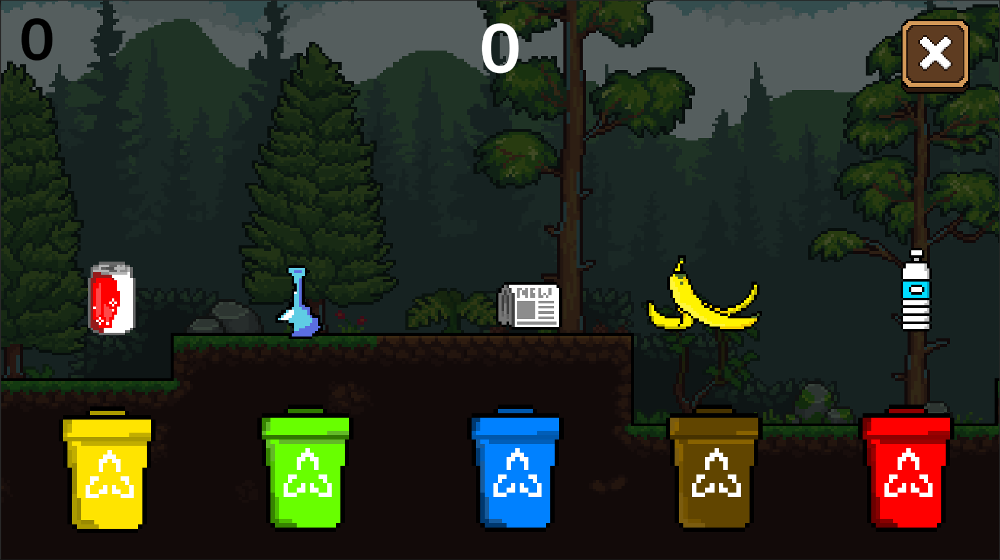
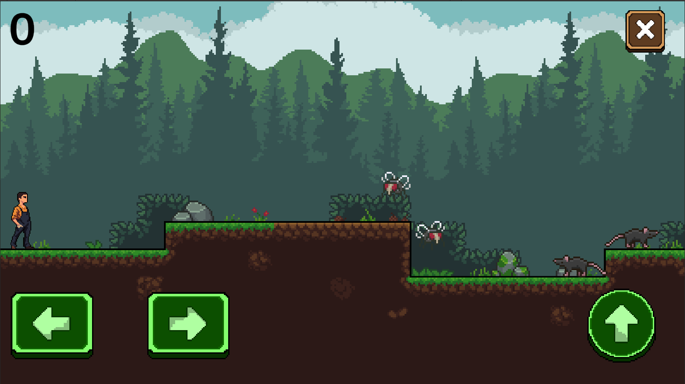

# APS - JOGO
---

# ♻️ Recicle

Um jogo 2D plataforma em pixel art desenvolvido na Unity, com foco em reciclagem, exploração, pontuação e conscientização ambiental.

---

# 🎮 Sobre o jogo

**Recicle** é um projeto acadêmico desenvolvido na
🎓 Universidade Paulista

O jogo se passa em um ambiente poluído e tomado por resíduos espalhados pelo cenário.

O jogador assume o papel do protagonista responsável por limpar esse ambiente, coletando itens recicláveis, enfrentando inimigos e restaurando o equilíbrio da natureza.

A proposta une diversão com conscientização ambiental por meio de mecânicas interativas e gameplay estilo plataforma 2D.

---

# 📷 Screenshot

  

  

  

  

# ✨ Mecânicas implementadas

* ✅ Movimento do player
* ✅ Pulo
* ✅ Sistema de inimigos
* ✅ Eliminação de inimigos ao pular na cabeça
* ✅ Sistema de pontuação
* ✅ Coleta de itens recicláveis
* ✅ Drag and Drop de objetos
* ✅ Game Over
* ✅ Progressão por fases
* ✅ Interface mobile com botões touchscreen
* ✅ Compatibilidade com teclado no PC
* ✅ Colisão 2D
* ✅ Pixel Art
* ✅ Build multiplataforma

---

# 📱 Plataformas

O jogo foi desenvolvido com suporte para:

* 📱 **Mobile**
* 💻 **PC / Desktop**

---

# 🕹️ Controles

## PC

* **A / D** ou **← →** → movimentação
* **Espaço** → pular

## Mobile

* ⬅️ mover para esquerda
* ➡️ mover para direita
* ⬆️ botão de pulo

---

# 🏆 Objetivo

O objetivo principal do jogo é:

* ♻️ coletar resíduos espalhados pelo mapa
* 👾 derrotar inimigos
* ⭐ ganhar pontos
* 🌱 limpar o ambiente contaminado
* 🌍 incentivar a reciclagem e preservação ambiental

---

# 🛠️ Tecnologias utilizadas

* Unity
* C#
* Pixel Art
* Physics 2D
* UI Mobile
* Sistema de Pontuação
* Drag and Drop
* Gameplay Platformer 2D

---

♻️ <strong>Recicle</strong> — jogar, reciclar e preservar.

